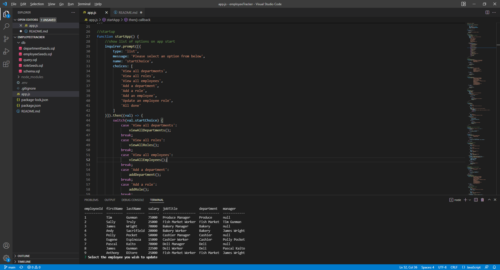

# employeeTracker

## Description

The employeeTracker is an app that can update a database of employees to help improve the orginization of a companies work force. The motivation behind this was to learn more about how to utilize MySQL.

I learned a lot about how to control what happens in a database from this project and will use what I learned to delve even deeper on the back-end side of coding.

## Table of Contents

- [Description](#description)
- [Installation](#installation)
- [Usage](#usage)

## Installation

Requires npm  
* console.table
* dotenv
* inquirer
* mysql2

Requires the database MySQL  
Requires a created database with tables that include (department, role and employee)

## Usage

Click the image to go to a video of the app

[](https://drive.google.com/file/d/1kebIt7MP7oZoFhXJotVkamCW7Djgexqq/view)]

```md
GIVEN a command-line application that accepts user input
WHEN I start the application
THEN I am presented with the following options: view all departments, view all roles, view all employees, add a department, add a role, add an employee, and update an employee role
WHEN I choose to view all departments
THEN I am presented with a formatted table showing department names and department ids
WHEN I choose to view all roles
THEN I am presented with the job title, role id, the department that role belongs to, and the salary for that role
WHEN I choose to view all employees
THEN I am presented with a formatted table showing employee data, including employee ids, first names, last names, job titles, departments, salaries, and managers that the employees report to
WHEN I choose to add a department
THEN I am prompted to enter the name of the department and that department is added to the database
WHEN I choose to add a role
THEN I am prompted to enter the name, salary, and department for the role and that role is added to the database
WHEN I choose to add an employee
THEN I am prompted to enter the employee’s first name, last name, role, and manager, and that employee is added to the database
WHEN I choose to update an employee role
THEN I am prompted to select an employee to update and their new role and this information is updated in the database 
```